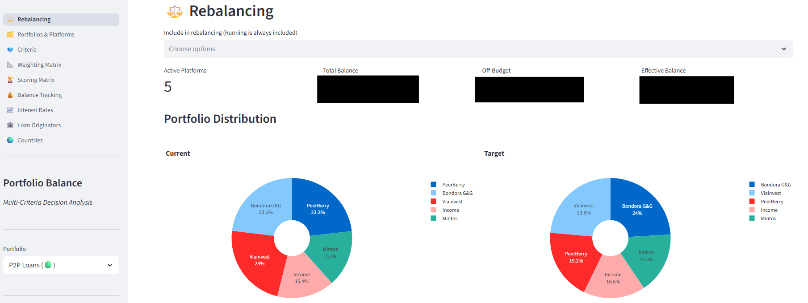
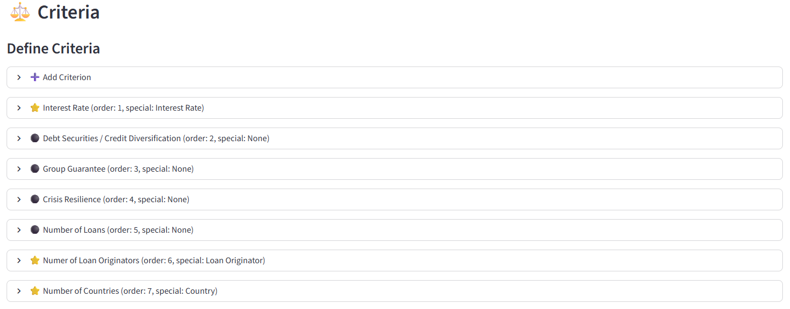
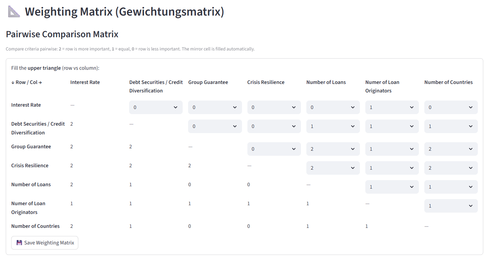
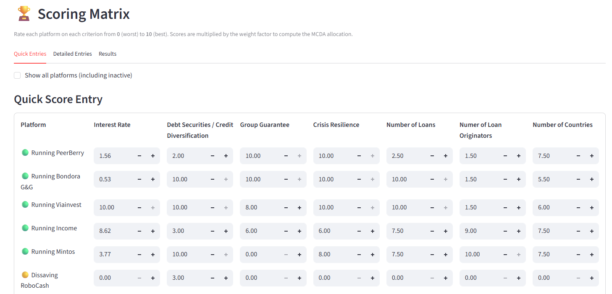
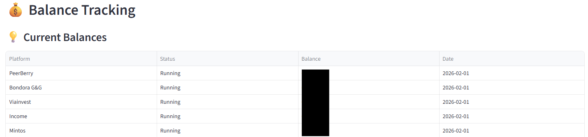
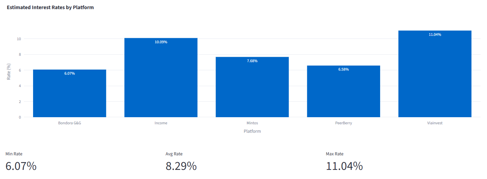
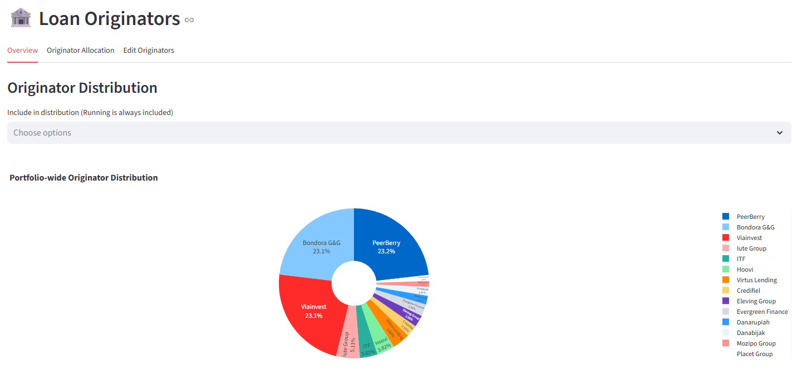
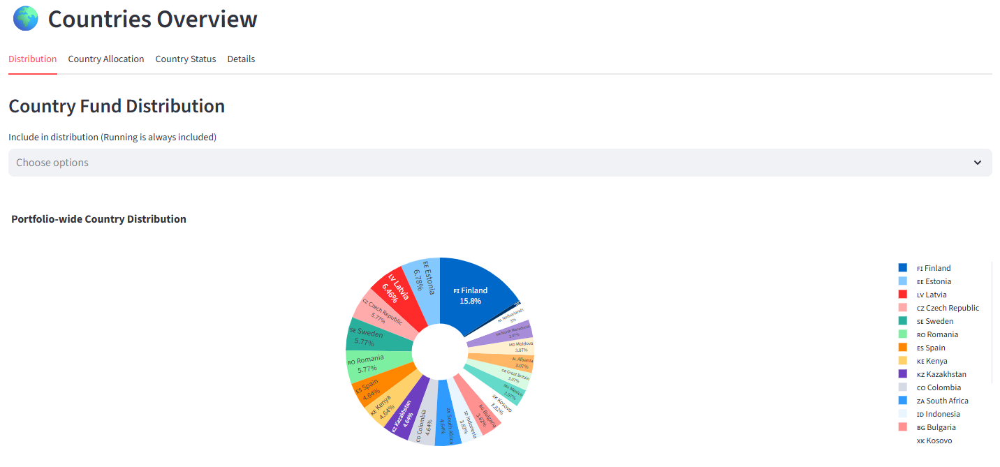
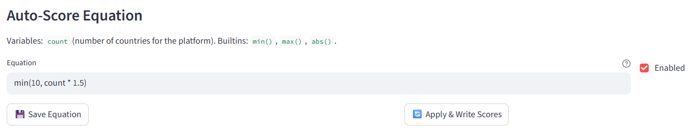

# Portfolio Balance

A **Streamlit** web application for managing P2P lending investment portfolios using **Multi-Criteria Decision Analysis (MCDA)**. It helps determine optimal fund allocation across platforms, track balances, and monitor deviations from your target portfolio.

## Features

- **Rebalancing dashboard** — current vs target pie charts, deviation bar chart, KPI metrics, off-budget pockets

- **Portfolio & platform management** with status tracking (Running / Dissaving / Defaulted / Closed)
- **MCDA allocation** — custom criteria, pairwise weighting matrix, 0–10 scoring per platform



- **Balance tracking** — snapshots per platform & date, history with deletion

- **Interest rate comparison** — bar chart with min/avg/max stats

- **Loan originator tracking** — per-platform originators with country, loan count, 11 priority-ordered statuses; allocation (manual or equal)

- **Country status management** — color-coded indicators, per-platform allocation (manual or equal), fund distribution chart, cross-platform status matrix; country inheritance from originator data

- **Auto-score equations** — configurable formulas for interest-rate, country-count, and originator-count criteria


## Architecture

```
pb-data/                             # DuckDB file (cloud-sync friendly)
app/
├── main.py                          # Entry point + st.navigation page routing
├── models/
│   ├── database.py                  # DuckDB connection (@st.cache_resource) + schema
│   └── repositories.py              # All SQL queries (data access layer)
├── viewmodels/
│   ├── portfolio_vm.py              # Portfolio & Platform CRUD
│   ├── mcda_vm.py                   # Criteria, weighting, scoring, allocation
│   └── balance_vm.py                # Balances, pockets, rates, countries, originators, auto-score
└── views/
    ├── components/common.py         # Shared helpers (badges, selectors, flags)
    └── pages/                       # Streamlit page modules
        ├── dashboard.py
        ├── portfolios.py
        ├── criteria.py
        ├── scoring.py
        ├── balances.py
        ├── interest_rates.py
        ├── countries.py
        └── loan_originators.py
```

**MVVM pattern**: Models (DuckDB) → ViewModels (business logic) → Views (Streamlit UI).
All SQL lives in `repositories.py`; viewmodels contain only business logic.

## Tech Stack

- **[Streamlit](https://streamlit.io/)** — Web UI framework
- **[DuckDB](https://duckdb.org/)** — Embedded analytical database
- **[Pandas](https://pandas.pydata.org/)** — Data manipulation
- **[Plotly](https://plotly.com/python/)** — Interactive charts
- **[NumPy](https://numpy.org/)** — Numerical operations
- **[pycountry](https://github.com/pycountry/pycountry)** — Country name → flag resolution

## Getting Started

```bash
git clone https://github.com/Santuzius/portfolio-balance.git
cd portfolio-balance
python -m venv .venv
source .venv/bin/activate
pip install -r requirements.txt
streamlit run app/main.py
```

The app opens at [http://localhost:8501](http://localhost:8501).

## Quick Start Guide

1. **Create a portfolio** on the Portfolios page
2. **Add platforms** (e.g. Mintos, PeerBerry, Bondora G&G)
3. **Define criteria** (e.g. Liquidity, Reliability) and **fill the weighting matrix**
4. **Score platforms** (0–10 per criterion)
5. **Record balances** and **view the Dashboard** for deviation analysis

## License
MIT License. See [LICENSE](LICENSE) for details.